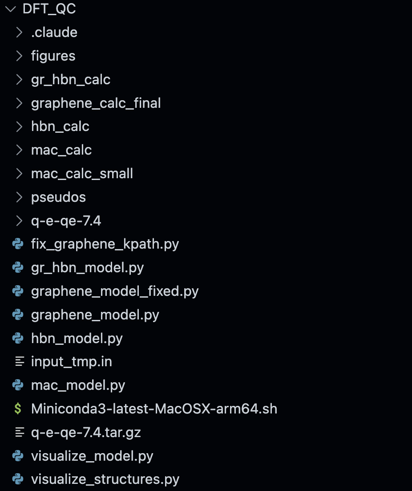
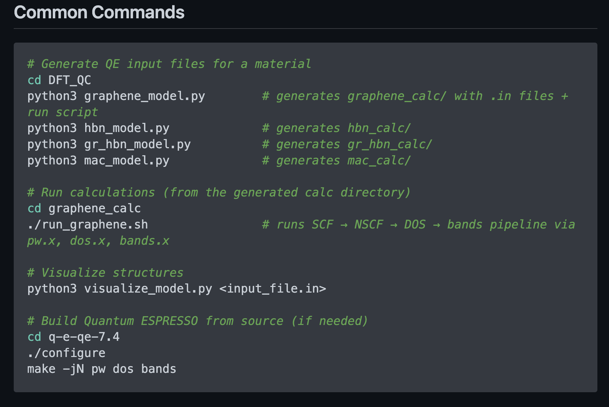
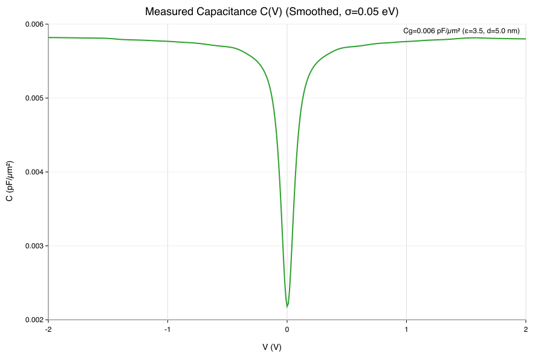
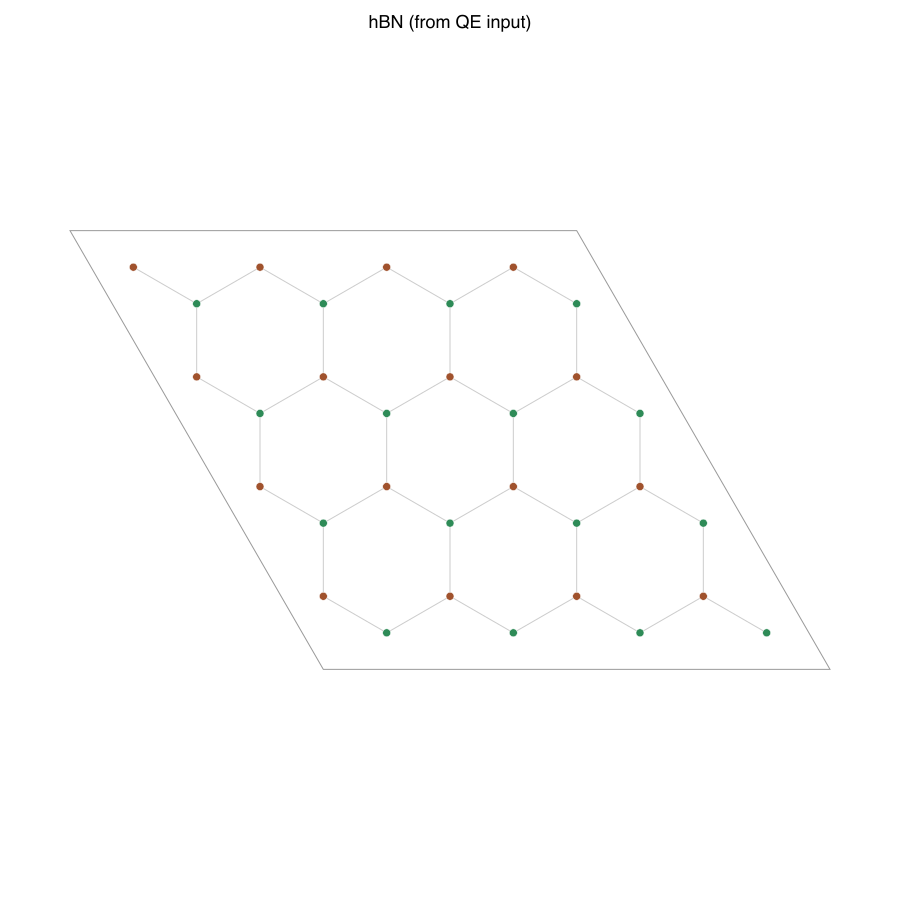

# Example 2 — Automation & scripting: “From scratch to Cq(V)” with Quantum ESPRESSO (Graphene/hBN capacitor)

---

## What this example demonstrates
CodeX helps a new contributor go from “I want quantum capacitance for graphene/hBN” to runnable outputs **fast** by:
- generating a working QE calculation set (SCF → NSCF → DOS → Bands),
- creating a repeatable **run script** and **parameter sweep** (k-grid, cutoff, smearing, thickness, etc.),
- adding a **results parser** that collects key numbers into a single CSV,
- producing an **analysis notebook** that computes and plots **Cq(V)** from DOS data, consistent with the fitting model used in `plot_qc2_qc4.ipynb`,
- documenting assumptions and “what to tune next” in a README.

> **Outcome:** a new `*_model.py` (or modifications to an existing one), a generated `*_calc*/` directory with inputs + run scripts, plus `figures/` and an `analysis.ipynb` that produces Cq(V).

---

## Scientific goal (fast, concrete, testable)
Compute a **first-pass quantum capacitance Cq(V)** for one of:
- graphene (baseline),
- hBN (insulating reference),
- graphene/hBN heterostructure (capacitor-relevant),
then compare:
- qualitative shape of Cq(V),
- sensitivity to broadening/smearing and k-point density,
- (optional) thickness dependence via `d` for geometric capacitance coupling.

---

## The task for CodeX
Ask CodeX to implement or extend the repository’s standard pipeline for a chosen system (recommended: `gr_hbn_model.py`).

### CodeX should produce
1. **A model builder** following the repo’s “Model builder pattern”
   - class encapsulating lattice parameters, pseudos, cutoffs, kpoints
   - methods like `generate_scf_input()`, `generate_nscf_dos_input()`, `generate_bands_input()`
   - `generate_all()` that writes:
     - `*_calc*/` directory
     - `.in` files for each stage
     - `run_*.sh` script

2. **A runnable pipeline**
   - SCF (pw.x)
   - NSCF for DOS (pw.x on denser k-grid)
   - DOS extraction (dos.x) and/or projected DOS (projwfc.x if used here)
   - Bands (pw.x + bands.x) along a k-path

3. **Automation extras**
   - `sweep.yaml` (or similar) to vary a small set of parameters (fast sanity sweep):
     - k-point mesh (coarse vs moderate)
     - smearing/broadening (e.g., 10–100 meV equivalent)
     - cutoff (one step up for a check)
   - a tiny script that expands the sweep into multiple calc folders and runs them

4. **Post-processing**
   - `parse_results.py` that walks calc directories and writes a single `results.csv`:
     - system, kmesh, cutoff, smearing
     - total energy, Fermi level (if available)
     - DOS file paths and metadata
   - `analysis.ipynb` that:
     - reads DOS → computes **Cq(V)** using the repo’s graphene DOS model or numerical DOS integration
     - produces plots into `DFT_QC/figures/`

---

## Suggested prompt for CodeX (copy/paste)
> “In this repository, implement a fast, end-to-end workflow to compute quantum capacitance Cq(V) for a graphene/hBN heterostructure using Quantum ESPRESSO.  
> Create `DFT_QC/gr_hbn_model.py` so it generates a `gr_hbn_calc/` directory containing SCF, NSCF (DOS), DOS, and bands inputs, plus a run script `run_gr_hbn.sh`.  
> Generate `analysis.ipynb` that computes and plots Cq(V) from DOS data consistent with the C(V) modeling approach used in `hBN_QC/plot_qc2_qc4.ipynb` (series Cq/Cgeom + Cpar, with Fermi-Dirac broadening).  
> Include comments explaining every QE input knob and document assumptions + recommended next-tuning steps in a README.”

---

⸻

Success criteria for the lab:
	
    - generate a calc directory with a model builder (*_model.py)
	- run the full QE pipeline with one script
    - produce results.csv
	- produce at least one meaningful Cq(V) figure in DFT_QC/figures/

