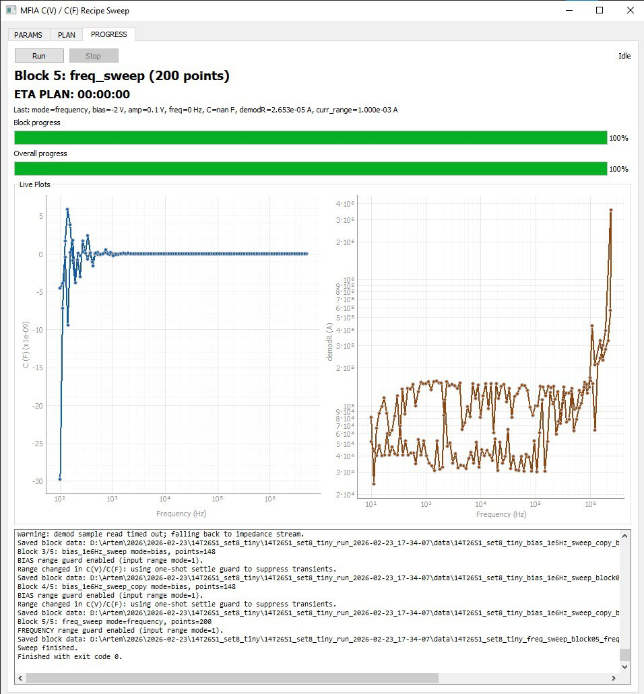
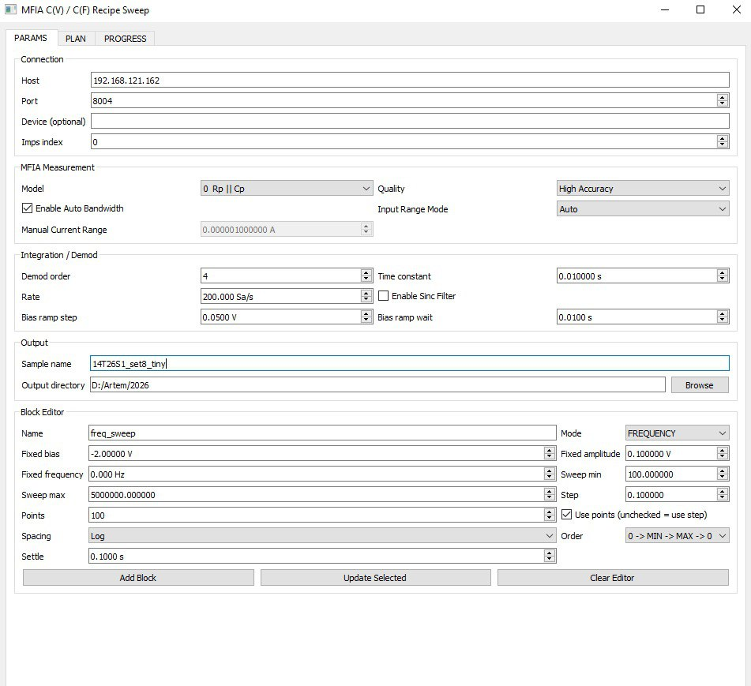

# Example 3 — Software development: Measurement app for Zurich Instruments MFIA

## What this example demonstrates
This lab shows how **CodeX** can build a *real* measurement application by reading vendor documentation (here: **Zurich Instruments MFIA**) and turning it into:
- a working instrument-control layer (connect, configure, acquire),
- a clean **PyQt** UI (operator-friendly),
- a robust measurement engine (state machine, retries, safe stop),
- reliable data logging (metadata + raw traces + export),
- packaging for lab use (one installer / one command run).

> **Outcome:** a minimal-but-solid desktop app that can run repeatable MFIA measurement recipes (e.g., impedance sweep, C–F, C–V), record data, and recover gracefully from common failures.




---

## Scenario
Your lab wants a measurement tool for MFIA that:
- is easier than rerunning manually from the vendor’s software,
- enforces consistent settings (reduces operator error),
- logs everything needed for reproducibility,
- doesn’t crash mid-run (and if it does, it fails safely).

The user is assumed to have:
- MFIA connected (USB/Ethernet),
- Zurich Instruments software installed,
- access to the MFIA programming interface (usually via their API / examples).

---

## Inputs you provide CodeX (the “docs-driven” part)
Give CodeX:
1. **Equipment documentation** (PDF/HTML) or links you paste into the repo as `docs/`
2. Any **existing lab conventions** (file naming, metadata fields, default measurement settings)
3. One or two target “recipes” to implement first:
   - **C–F** (capacitance vs frequency) at fixed bias
   - **C–V** (capacitance vs bias) at fixed frequency (e.g., 100 kHz)
   - optional: impedance magnitude/phase, Bode plot

---

## The task you give CodeX
Ask CodeX to build the app in layers:

### 1) Driver layer (instrument control)
Responsibilities:
- connect/disconnect
- set parameters (frequency, amplitude, bias, ranges, demod settings)
- start/stop acquisition
- stream data with timestamps
- read status + errors

Design expectations:
- a thin `MfiaClient` wrapper around the vendor API
- explicit mapping of “UI controls” → “instrument nodes/settings”
- defensive checks (device not connected, invalid ranges, conflicting settings)

### 2) Measurement engine (reliable operation)
Implement a **state machine** (not “do everything in one button handler”):
- `IDLE → CONNECTED → CONFIGURED → RUNNING → FINISHING → IDLE`
- `ERROR` state with recovery steps
- `STOPPING` state (ensures safe stop + data flush)

Reliability features:
- retries on transient read failures
- timeouts on operations that can hang
- safe stop (always returns MFIA to a known state, 0V bias 0V gate etc.)
- “resume or restart” behavior for sweeps if desired
- background worker thread (UI never freezes)

### 3) UI layer (PyQt operator workflow)
A good UI for lab operation typically includes:

**Main window sections**
- **Connection panel**: device discovery, connect/disconnect, live status
- **Recipe selector**: C–F / C–V / impedance sweep
- **Parameters panel**: editable + validated inputs
- **Run control**: Start / Pause / Stop + progress bar + ETA (optional)
- **Live plots**: real-time capacitance/impedance + last N points
- **Log console**: warnings, errors, “what changed”
- **Data output panel**: destination folder + filename template + metadata fields

PyQt choices that work well:
- Qt Designer `.ui` files or pure-code UI
- `QThread`/`QRunnable` for measurement workers
- `pyqtgraph` for fast live plotting




---

## Data model & file outputs (reproducibility)
Require the app to save:
- **raw data** (CSV or Parquet)
- **metadata** (JSON/YAML sidecar)
- **run log** (plain text)
- optional: **summary** (aggregated metrics)

Suggested run folder:

```└───sample_run_2026-02-21_17-22-39
    │   sample_plan_2026-02-21_17-22-39.json
    │   sample_run_2026-02-21_17-22-39.log
    │
    ├───data
    │       sample_iv_sweep_block01_bias_linear_zminmaxz_2026-02-21_17-22-39.csv
    │
    └───plots
            sample_block01_iv_sweep_C_block_done_2026-02-21_17-22-55.png
            sample_block01_iv_sweep_C_completed_2026-02-21_17-22-55.png
            sample_block01_iv_sweep_R_block_done_2026-02-21_17-22-55.png
            sample_block01_iv_sweep_R_completed_2026-02-21_17-22-55.png
```

Minimum metadata fields:
- device ID, firmware version (if available)
- recipe name and all measurement parameters
- start/end timestamps
- sample identifier (e.g., `qc{N}_g2bn1_{type}`)
- calibration/range settings

```
{
  "created": "2026-02-21T17:22:39",
  "config": {
    "host": "192.168.121.162",
    "port": 8004,
    "device": "",
    "imps": 0,
    "model": 0,
    "quality": 2,
    "auto_bw": true,
    "inputrange_mode": 1,
    "manual_current_range": 1e-06,
    "demod_order": 4,
    "demod_timeconstant": 0.01,
    "demod_rate": 200.0,
    "demod_sinc": false,
    "ramp_step": 0.05,
    "ramp_wait": 0.01
  },
  "blocks": [
    {
      "name": "iv_sweep",
      "mode": "bias",
      "min_value": -9.0,
      "max_value": 9.0,
      "spacing": "linear",
      "use_points": true,
      "step": 0.1,
      "points": 100,
      "order": "zero_min_max_zero",
      "fixed_bias": 0.0,
      "fixed_amplitude": 0.1,
      "fixed_frequency": 0.0,
      "settle_s": 0.1
    }
}
```
---

## Development plan (what CodeX should generate)
Ask CodeX to create these deliverables:

### Deliverable A — Architecture skeleton
- `drivers/mfia_client.py`
- `core/state_machine.py`
- `core/recipes.py` (C–F, C–V as structured objects)
- `data/writer.py` (atomic writes, metadata, safe flush)
- `ui/main_window.py` (PyQt)
- `ui/widgets/*` (reusable parameter controls)


### Deliverable B — Two recipes implemented end-to-end
Start simple:
1. **C–F**: fixed bias, sweep frequency
2. **C–V**: fixed frequency (100 kHz), sweep bias

Each recipe should:
- validate parameters
- configure MFIA
- execute sweep
- stream data to UI + writer
- generate preview plot at end

### Deliverable C — Reliability checklist
Require CodeX to implement:
- “Stop always works” (even mid-sweep)
- “Disconnect while running” handled (transitions to ERROR + safe cleanup)
- autosave every N seconds / N points (crash-resilience)
- clear error messages for operators


---

## Suggested prompt for CodeX (copy/paste)
> “Build a desktop measurement application for Zurich Instruments MFIA based on the vendor documentation in `docs/`.  
> Use Python with PyQt (and pyqtgraph for live plots).  
> The app must be reliable: measurement logic in a state machine, runs in a background thread, safe stop/cleanup, timeouts, retries, and robust error handling.  
> Implement two measurement recipes end-to-end:  
> 1) Capacitance vs Frequency (C–F) at fixed bias,  
> 2) Capacitance vs Voltage (C–V) at fixed frequency (default 100 kHz).  
> Save raw data + metadata + logs per run in a structured output folder.  
> Provide clear mapping between UI controls and MFIA configuration nodes/settings, with validation.  
> Include unit tests for recipe parameter validation and a ‘dry run’ simulation mode (no hardware) for UI testing.”

---

## Success criteria for the lab
You can consider the example complete when:
- the app can connect to MFIA and show live device status,
- C–F and C–V runs complete and save reproducible run folders,
- stopping mid-run is safe and consistent,
- the UI remains responsive throughout,
- logs clearly show configuration + any warnings/errors,
- the simulation mode can run without hardware for demos/tests.

---

## Optional extensions (if you want to go further)
- Recipe editor UI (save/load recipe presets as YAML)
- Automatic calibration/range selection with guardrails
- Multi-device support (MFIA + Keithley or similar)
- Packaging: `pyproject.toml` + `briefcase`/`pyinstaller` for a one-click app
